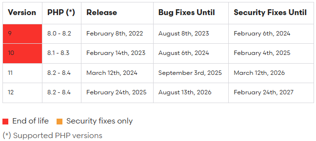

# Modul Praktikum - Minggu 02 - Pengantar

Dosen Pengampu : **Arif Wicaksono Septyanto, S.Kom, M.Kom**
Asisten Dosen : **Rifki Anashirul & Zidane Alfarizi**

Pada modul praktikum ini, kita akan mempelajari tentang PHP framework Laravel,
menjalankan program sederhana di _Web Browser_, instalasi Composer, instalasi
Laragon, dan instalasi Framework **Laravel**.

> Salah satu cara efektif untuk belajar bahasa pemrograman adalah dengan mengetik ulang kode yang ditemukan di buku atau sumber online, kemudian memodifikasinya untuk melihat apakah kita sudah benar-benar memahami cara kerjanya. Proses eksperimen dan eksplorasi sangat penting agar kita bisa memahami fungsi dan kegunaan setiap perintah dalam bahasa pemrograman yang sedang dipelajari.

## Sedikit hal tentang Framework Laravel

### Apa itu Laravel?

Laravel adalah framework PHP open-source yang dirancang untuk mempermudah pengembangan aplikasi web dengan pendekatan yang elegan dan efisien. Laravel mengikuti pola arsitektur MVC (Model-View-Controller) , sehingga membantu pengembang memisahkan logika bisnis, tampilan, dan data dalam aplikasi.

Framework ini menyediakan berbagai fitur bawaan seperti routing , autentikasi , manajemen database , migrasi , template engine (Blade) , dan sistem queue , yang mempercepat proses pengembangan aplikasi. Laravel juga dikenal karena kemudahan dalam menangani operasi kompleks, seperti pengelolaan API dan integrasi dengan tools modern.

Dengan sintaks yang bersih dan dokumentasi yang lengkap, Laravel sangat cocok untuk pemula maupun pengembang berpengalaman dalam membangun aplikasi web skala kecil hingga besar.

Singkatnya, Laravel adalah alat yang powerful untuk membuat aplikasi web dinamis dengan cepat dan terstruktur.

## Version Laravel

Versi Laravel setiap tahun akan selalu berubah mengikut penyesuaian terhadap teknologi yang berkembang. Melalui praktikum ini, kita akan menggunakan **LARAVEL VERSI 11.XX** yang akan di gunakan.

## Mengapa Harus Laravel?

Laravel dipilih sebagai framework PHP karena beberapa alasan kuat berikut:

1. **Sintaks Sederhana dan Elegan** : Laravel memiliki sintaks yang bersih dan intuitif, sehingga mempermudah pengembang untuk menulis kode dengan cepat dan efisien.
2. **Arsitektur MVC** : Dengan pendekatan Model-View-Controller (MVC) , Laravel membantu mengatur struktur aplikasi menjadi lebih terorganisir, memisahkan logika bisnis, tampilan, dan data.
3. **Fitur Bawaan yang Kaya**: Laravel menyediakan banyak fitur bawaan seperti routing , autentikasi , manajemen database (Eloquent ORM) , migrasi , caching , dan sistem queue , yang menghemat waktu pengembangan.
4. **Dokumentasi Lengkap** : Laravel memiliki dokumentasi yang sangat baik dan mudah dipahami, serta didukung oleh komunitas besar yang aktif.
5. **Keamanan Terjamin** : Laravel menyediakan mekanisme keamanan canggih seperti enkripsi, perlindungan **CSRF**, dan autentikasi built-in, menjaga aplikasi tetap aman dari ancaman umum.
6. **Skalabilitas dan Performa** : Laravel dirancang untuk mendukung aplikasi skala besar dengan performa tinggi, serta mudah diintegrasikan dengan layanan cloud dan teknologi modern.
7. **Kompatibilitas dengan PHP Modern** : Laravel selalu update dengan standar PHP terbaru, memastikan aplikasi menggunakan teknologi mutakhir.

## Hal-hal yang dibutuhkan

Sebelum menjalankan framework laravel, ada beberapa hal yang perlu di perhatikan. Seperti :

1. PHP Version = 8.3+
   > [PHP](https://windows.php.net/download/)
2. Composer = 2.8.3
   > [Composer](https://getcomposer.org/download/)
3. Web Server = Apache 2.4.60 or Nginx 1.26.2
   > [Apache](https://httpd.apache.org/download.cgi) or [Nginx](http://nginx.org/en/download.html)
4. Database Admin = TablerPlus or HeidiSQl or DBeaver
   > [TablerPlus](https://tableplus.com/download) or [HeidiSQL](https://www.heidisql.com/download.php) or [DBeaver](https://dbeaver.io/download/)

## Tugas - Excersice 01
